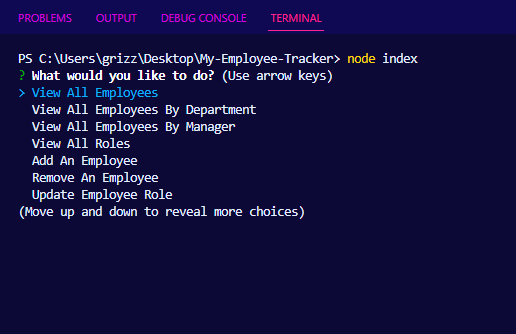
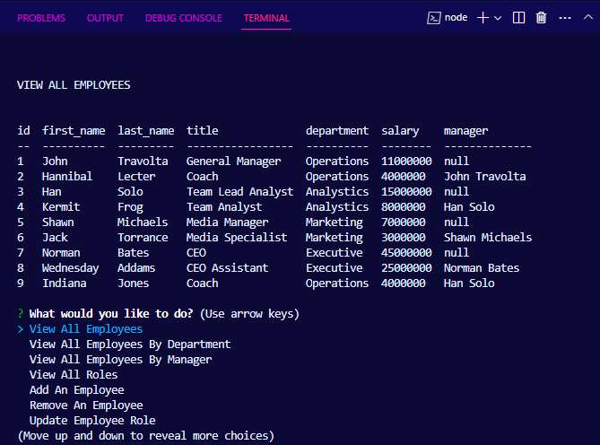

Richard Murillo's README

 # My Employee Tracker

## Table of Contents

 * [Description](#description)

 * [Installation](#installation)

 * [Usage-Information](#usage-information)

 * [Contribution-Guidelines](#contribution-guidelines)

 * [Test-Instructions](#test-instructions)

 * [License](#license)

 * [Questions](#questions)

## Description

Employee Tracker is an application that allows the user to keep create, read, update, and delete data related to specific employees. When starting up the application the user has the option of viewing all employees, viewing employees by department, adding an employee, remove employees, add departments, and add roles. When the user chooses an option the corresponding table appears in the terminal using node, inquirer, and MySQL.

## Installation

Clone the repo: https://github.com/RichMur84/My-Employee-Tracker.git 

## Usage Information

 *  In the terminal type npm i to install files needed. 
 
 * Install npm inquirer
  
 * Install npm init
 
 * Install npm i mysql 
 
 * npm console.table 
 
 * Then Run node index.js

## Contribution Guidelines

Please any questions and suggestions contact me. I would like to thank 

## Test Instructions
Video:
 
https://drive.google.com/file/d/1MsQKdilEoelzfN1rxTm-fIyGkZ6ztfVo/view
 
Screenshots:
 
 
 

## Used In This Project

## License

NOTICE: This application is covered under the MIT

## Questions

Have additional questions? Click the links below to reach me through my GitHub account or Email address.

[Link to Github](https://github.com/https://github.com/RichMur84)

<a href="mailto:grizzlylbc1gmail.com">grizzlylbc1gmail.com</a>

